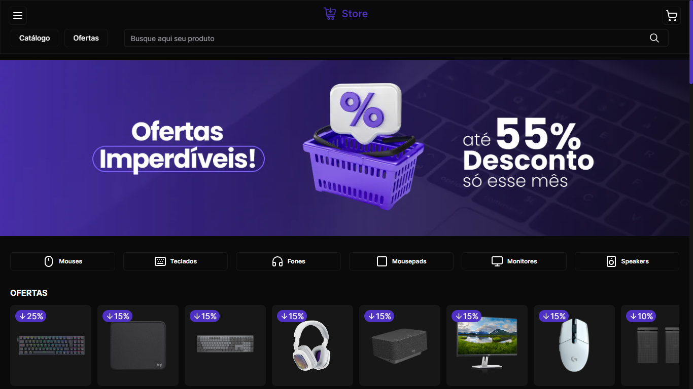
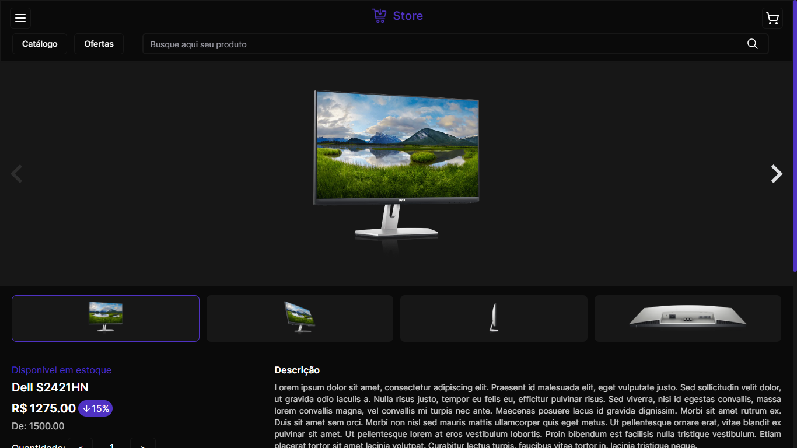
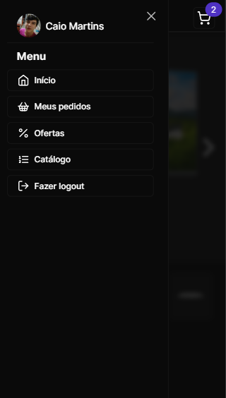
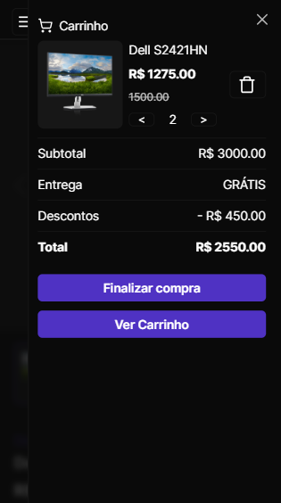
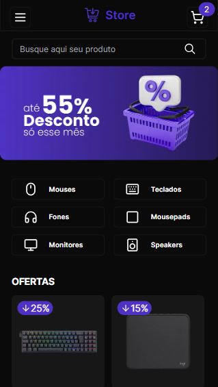
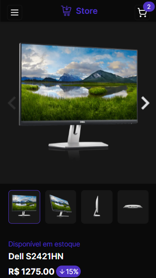

## 🖥 Desktop

## 📱 Mobile

## 📌 Sobre

**Store** é um projeto de e-commerce.

## 🚀 Tecnologias utilizadas

O projeto foi desenvolvido utilizando as seguintes tecnologias:

- [Next](https://nextjs.org/)
- [Typescript](https://www.typescriptlang.org/)
- [NextAuth](https://next-auth.js.org/)
- [Stripe](https://stripe.com/br?utm_campaign=BR_en_Search_Brand_Brand_EXA-15088005049&utm_medium=cpc&utm_source=google&ad_content=603963803239&utm_term=stripe&utm_matchtype=e&utm_adposition=&utm_device=c&gclid=CjwKCAiAgeeqBhBAEiwAoDDhn-uFC7kxKBhv1mdhEDV3YF4t4_p4CPb-thEMXqIVVWYa3wJBK0KwchoCu-cQAvD_BwE)
  
- [Tailwindcss](https://tailwindcss.com/)
- [Shadcn](https://ui.shadcn.com/)
- [React Hook Form](https://www.react-hook-form.com/)
- [React Query](https://tanstack.com/query/v3/)
- [Zod](https://zod.dev/)
- [Zustand](https://zustand-demo.pmnd.rs/)
- [Keen-Slider](https://keen-slider.io/)

## Colors

| Color             | Hex                                                                |
| ----------------- | ------------------------------------------------------------------ |
| Primary Color |  #4f32c3 |
| Accent Color |  #171717 |
| Background Color |  #0a0a0a |

## 💻 O projeto pode ser vizualizado acessando o seguinte link

<https://store-caio.vercel.app/>

## 📦  Exemplo

